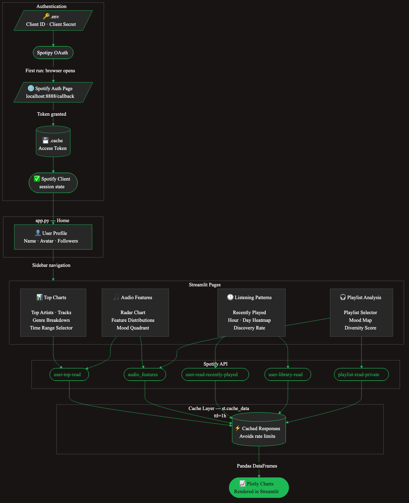

# My Spotify Wrapped

A locally hosted Streamlit dashboard that connects to your Spotify account and gives you deeper, more personal insights than Spotify's official Wrapped.

## Features

| Page | What you get |
|------|-------------|
| 🏠 Home | Your profile overview |
| 📊 Top Charts | Top artists, tracks, and genres across 3 time ranges |
| 🎵 Audio Features | Sonic fingerprint — radar chart, mood quadrant, feature distributions |
| 🕐 Listening Patterns | Heatmap by hour/day, recently played feed, library timeline |
| 🎧 Playlist Analysis | Mood map, diversity score, track-level breakdown per playlist |

## Setup

### 1. Create a Spotify App

1. Go to [Spotify Developer Dashboard](https://developer.spotify.com/dashboard)
2. Create a new app
3. Add `http://127.0.0.1:8888/callback` as a Redirect URI
4. Copy your **Client ID** and **Client Secret**

### 2. Configure credentials

Create a `.env` file in the project root:

```env
SPOTIFY_CLIENT_ID=your_client_id_here
SPOTIFY_CLIENT_SECRET=your_client_secret_here
SPOTIPY_REDIRECT_URI=http://127.0.0.1:8888/callback
```

### 3. Install dependencies

```bash
uv sync
```

### 4. Run the app

```bash
uv run streamlit run app.py
```

On the **first run**, a browser window will open for Spotify OAuth. After authorizing, the token is cached in `.cache` and subsequent runs won't require re-authentication.

The app will be available at `http://localhost:8501`.

## Architecture


